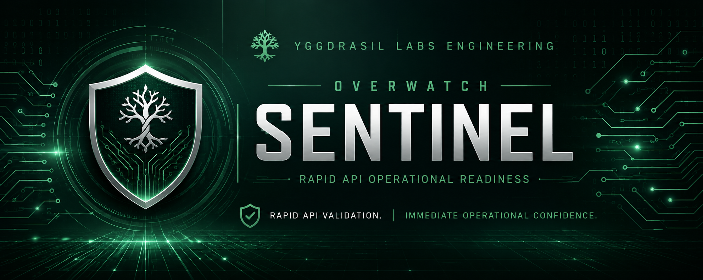

# 🌳 Yggdrasil Labs Engineering

# 🛡 OVERWATCH Sentinel

## Rapid API Operational Readiness

> **Operational Readiness Verification. Immediate Engineering Confidence.**




## Philosophy

> Verify.

> Do Not Repair.

---

# Current Status

Sentinel v0.1

✅ Repository Established

✅ Engineering Documentation

✅ Product Definition

🚧 Desktop Interface

🚧 Operational Readiness Pipeline

🚧 HTML Reporting

🚧 crAPI Validation

---

# Why Sentinel Exists

Before an application can be functionally tested, performance tested, or security assessed, engineers must answer one simple question:

> **Is the application healthy enough to continue testing?**

That initial verification is often repetitive, manual, and inconsistent across engineering teams.

Sentinel exists to automate that process.

By validating authentication, endpoint availability, response integrity, and operational health, Sentinel provides immediate confidence that an application is ready for deeper testing.

Sentinel is intentionally lightweight.

Rather than replacing full testing frameworks, it provides rapid operational readiness validation that can be executed independently or as the first stage of the OVERWATCH assessment platform.

---

# Mission

Operational Readiness Verification.

Immediate Engineering Confidence.

Sentinel's mission is to provide fast, repeatable operational verification that allows engineers to identify critical failures before investing time in deeper testing activities.

Every execution should answer one question:

> **Is the application healthy enough to continue testing?**

---

# Core Responsibilities

Sentinel is responsible for:

- API Smoke Testing
- Authentication Validation
- Health Endpoint Verification
- HTTP Response Validation
- JSON Payload Validation
- Endpoint Availability Testing
- Operational Status Reporting
- HTML Report Generation
- CI/CD Ready Exit Codes

---

# Operational Readiness Pipeline

```text
Application
      │
      ▼
Authentication
      │
      ▼
Health Verification
      │
      ▼
Endpoint Validation
      │
      ▼
Response Validation
      │
      ▼
PASS / FAIL
      │
      ▼
HTML Report
```

Every assessment begins with operational readiness.

---

# Operational Philosophy

Sentinel is built around one engineering principle:

> **Automate repetitive validation so engineers can focus on solving problems.**

Operational readiness should always be:

- Fast
- Reliable
- Repeatable
- Explainable
- Lightweight

Operational readiness should be trusted enough to verify every deployment. 

---

# Validation Engine

Each Sentinel execution validates:

- Authentication
- Application Health
- Critical API Endpoints
- Expected HTTP Responses
- JSON Payload Integrity
- Endpoint Availability
- Overall Operational Status

The objective is immediate operational confidence.

---

# Current Development Status

## Current Phase

🟢 Foundation

### Completed

- ✅ Repository Created
- ✅ Engineering Standards
- ✅ Product Definition
- ✅ Documentation Framework
- ✅ Architecture Planning

### In Progress

- ⬜ PySide6 Desktop Application
- ⬜ Smoke Testing Engine
- ⬜ HTML Reporting
- ⬜ crAPI Integration

---

# Roadmap

## Phase 1 — Operational Readiness

🔄 In Progress

- Desktop GUI
- Health Checks
- Authentication
- Endpoint Validation
- HTML Reports

---

## Phase 2 — Advanced Smoke Testing

- Parallel Endpoint Validation
- Response Time Metrics
- Configuration Profiles
- Enhanced Reporting

---

## Phase 3 — Platform Integration

- OVERWATCH Integration
- GitHub Actions
- Jenkins
- Azure DevOps
- CI/CD Support

---

## Phase 4 — Enterprise Readiness

- Plugin Architecture
- JWT Validation
- OAuth Support
- Service Dependency Validation
- Dashboard Integration

---

# Repository Structure

```text
overwatch-sentinel/

├── src/
├── tests/
├── docs/
├── assets/
├── config/
├── examples/
├── README.md
├── PRODUCT.md
├── LICENSE
└── pyproject.toml
```

---

# Technology Stack

| Technology | Purpose |
|------------|---------|
| Python | Core Application |
| PySide6 | Desktop Interface |
| Requests | REST Communication |
| PyYAML | Configuration |
| Jinja2 | HTML Reporting |
| GitHub | Version Control |

### Future Technologies

- Docker
- GitHub Actions
- Azure DevOps
- Jenkins
- OpenAPI Support

---

# How Sentinel Fits Into OVERWATCH

Sentinel verifies.

Inspector discovers.

Observer monitors.

Intelligence analyzes.

Odin decides.

Forge constructs.

Dashboard informs.

Operational confidence begins with Sentinel.

---

# Related Projects

🌳 **Yggdrasil Labs Engineering**  
Engineering philosophy and organizational standards.

🛡 **OVERWATCH Platform**  
Operational intelligence and API assessment ecosystem.

🛡 **Inspector**  
API discovery and inventory.

👁 **Observer**  
Operational monitoring and telemetry.

🧠 **Intelligence Engine**  
Context-aware analysis and risk evaluation.

⚖ **Odin**  
Explainable operational decision engine.

🔨 **Forge**  
Operational remediation construction engine.

📊 **OVERWATCH Dashboard**  
Operational visualization and reporting.

---

# Engineering Philosophy

Sentinel follows the engineering principles established by **Yggdrasil Labs Engineering**.

We believe software should be:

- Practical
- Maintainable
- Modular
- Well Documented
- Tested
- Built for Engineers

Engineering is not simply writing software.

Engineering is building software that people can trust.


---

# License

Released under the **MIT License**.